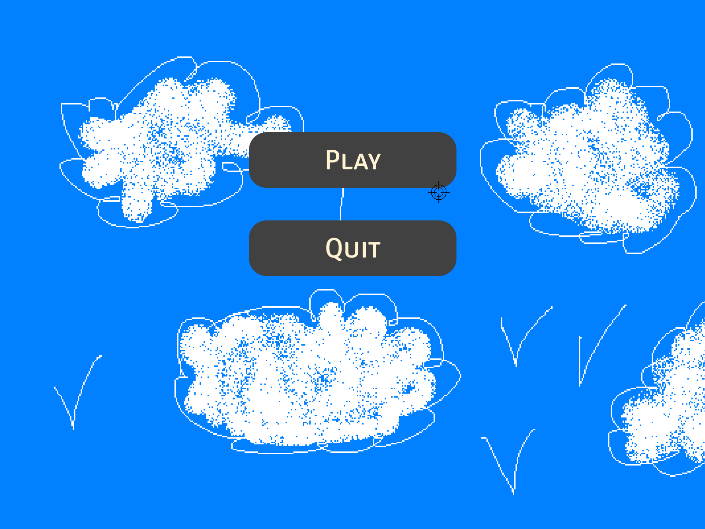

# MyHunter

### Introduction

Le MyHunter est notre premier projet graphique. C'est un jeu dans lequel le but est de détruire un maximum d'hélicoptères.

### **Fonctionnement**

Ce projet utilise la lib nommée "CSFML" qui permet de gérer une window et d'afficher des éléments graphiques à l'intérieur tels des sprites, des pixels etc... De plus cette lib nous permet de lancer des sons et des musiques, gérer les inputs pour récupérer la position de la souris, les touches du clavier etc...

Le jeu repose sur un petit moteur de jeu construit autour de la CSFML afin de gérer des physiques primitives, de gérer la création, affichage et destruction de plusieurs objets simultanément.

### Fonctionnalités

Le jeu inclut les caractéristiques suivantes:

* gestion d'événements telle la fermeture de la window, un clique de souris ou encore un touche du clavier tapée.
* Animation de sprite grâce aux spritesheet.
* Des objets en mouvements en fonction d'une clock afin de fluidifier les mouvements et qu'ils soient à la même vitesse sur n'importe quel ordinateur.
* Affichage du score en temps réel
* Un réticule en guise de curseur
* Une gestion de mémoire puissante grâce aux fonctions système tel free et malloc afin d'éviter des problèmes comme le dépassement de mémoire.

### Utilisation

Il suffit de compiler le projet avec make en ayant la lib CSFML d'installée sur le pc, puis de lancer le jeu avec la commande ./game.

### Aperçus

Voici un aperçus du magnifique menu principal du jeu.

.png>)

Enfin un aperçus du jeu en cours.
